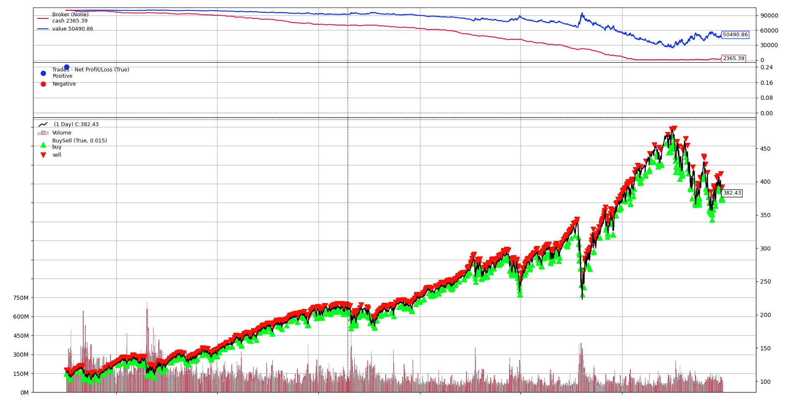
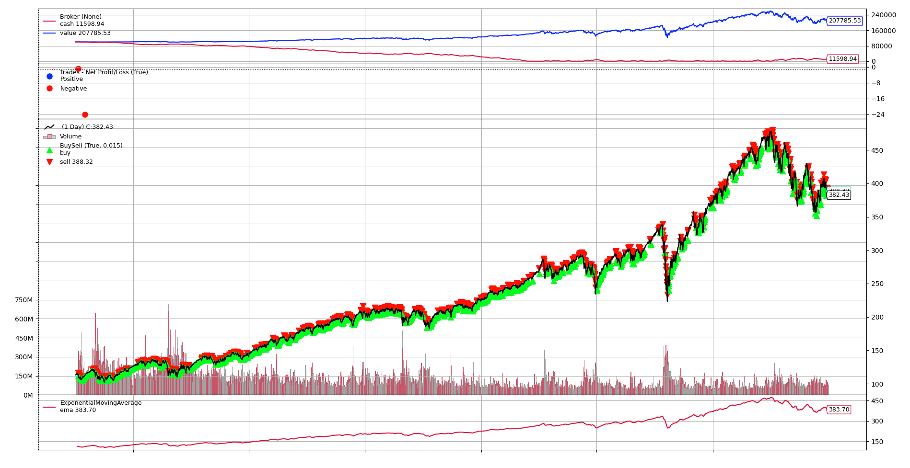
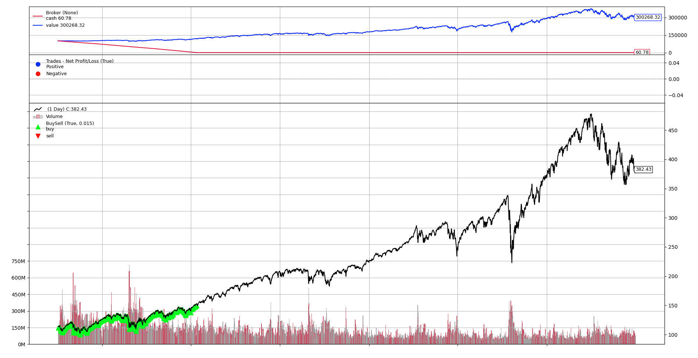

# AlpacaTradingBot

Trading bot tested with backtrader and running on Alpaca API.

`Note: Alpaca live trading in progress`

## How it's made
The package [backtrader](https://github.com/mementum/backtrader) is used for testing different trading strategies.
To get the data of historical prices, Yahoo Finance is accessed through the [yfinance](https://pypi.org/project/yfinance/) package.

## Strategies
So let's test some strategies!

#### Starting conditions:
* $100,000 cash
* From Jan 1st 2010 to Jan 1st 2023
* For simplicity, we are only testing this on SPY stock.
* No short selling

### Three Fall Buy
This strategy is simple. Whenever the price drops 3 times, buy, whenever it goes up 3 times, sell.

Let's test it out!

Wow, that is NOT good. Over a 13 year period, we actually <strong>lost</strong> half our investment!
It seems like this strategy is not very good. Onto the next one!

### Exponential Moving Average
This strategy does some cool math to find what is called the [exponential moving average](https://www.investopedia.com/terms/e/ema.asp) of a stock.
Then it checks the closing value of the stock.
* If the stock closing value greater than the EMA, this indicates a bullish signal. So we buy!
* If the stock closing value is less than the EMA, this indicates a bearish signal. So we sell.

EMA is calculated through this equation 
> **Note:** This math notation is specifically meant to be viewed on github. It may not work on other markdown interpreters.

$EMA_n = α * data_n + (1 - α) * EMA_{n-1}$

In this representation:
* $EMA_n$ represents the $EMA$ value at index $n$.
* $α$ is the smoothing factor, typically calculated as $2 / (period + 1)$ where period is the number of data points considered in the $EMA$ calculation.
* $data_n$ refers to the input data point at index $n$.
* $EMA_{n-1}$ represents the previous $EMA$ value at index $n-1$.

An implementation of this in Python is

$EMA[0] = alpha * close[0] + (1 - alpha) * EMA[-1]$
where
$alpha = 2 / (period + 1)$

Let's test it out!

Hey it looks like we made a good profit here! Around double our initial investment. Pretty good!
But now we have to move on to the final boss of trading strategies. <strong>Dollar Cost Averaging the S&P 500.</strong>

### Dollar Cost Average
The strategy is simple. Buy every week and hold!

Wow, that blew the 2 other strategies away!

## Conclusion

I guess the moral of the story is that dollar cost averaging is better in the long run. Even if it is pretty boring.